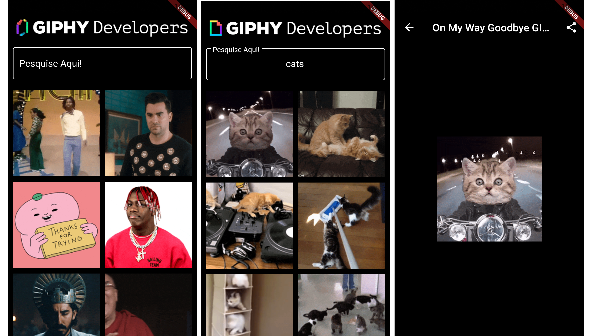

  <h3 align="center">Buscador Gifs</h3>

---

## Overview

This is a project created in the course of Daniel Ciolfi of Udemy which consists of consulting gifs of the GIPHY API.

## Preview

## APIs

- [GIPHY](https://developers.giphy.com/)

## Used technologies

- Flutter
- Dart
- Share
- Http

## Credits

- [Daniel Ciolfi](https://www.udemy.com/course/curso-completo-flutter-app-android-ios/)
